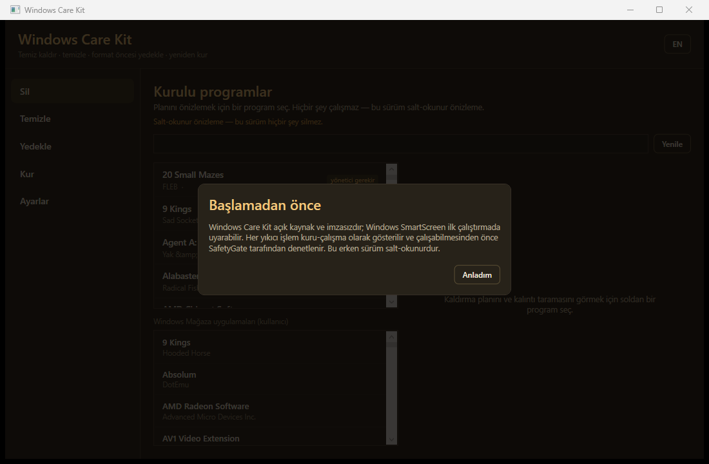

<div align="center">

# 🛡️ Windows Care Kit

**Carry your settings across a Windows reinstall — and get them back in the right place.**

*Open-source, ad-free, radically honest: it tells you what can't transfer instead of faking success. Covers the full format lifecycle: Uninstall · Clean · Backup · Reinstall.*

<!-- BADGE PLACEHOLDER — buraya rozet gelecek: build status, latest release, license, downloads -->
   
<!-- Yukarıdaki rozetlerin gerçek release/CI linkleri repo açılınca eklenecek -->

<!-- 📸 SCREENSHOT PLACEHOLDER #1 (HERO) — buraya ANA PENCERE ekran görüntüsü gelecek: shell + 4 modül kartı görünür -->
> 📸 **[Screenshot: Ana pencere — 4 modüllü shell. Buraya ana ekranın görüntüsü gelecek.]**

</div>

---

## ⚠️ Status — Beta, read this first

All four modules are **implemented**, the build is **clean (0 warnings / 0 errors)**, and the suite passes **~780 automated tests**. Every destructive action runs **only** behind a **dry-run preview + your explicit approval** through a single safety gate.

> **🚧 Real-world destructive operations are still undergoing supervised testing.** Treat this as **beta**: always have a separate backup before letting it delete, restore, or migrate on a machine you care about. See [Roadmap](#-roadmap) for what's built vs. planned.

---

## 🤔 What is it?

Windows Care Kit is **one native Windows app** that covers the whole **format / reinstall lifecycle** — the things you normally juggle across three or four separate (often ad-laden, opaque) tools. It is **open source, ad-free, telemetry-free, and auditable**, and it is **honest**: when something *can't* safely transfer (an encrypted password, a cloud-only save), the app tells you instead of pretending.

| Module | TR | What it does |
|---|---|---|
| 🗑️ **Uninstall** | **Sil** | Remove classic + UWP apps, scan & clean leftovers, run the official uninstaller, per-user AppX removal |
| 🧹 **Clean** | **Temizle** | Junk/temp cleanup (to Recycle Bin), startup manager, browser-extension inventory, empty Recycle Bin |
| 💾 **Backup** | **Yedekle** | Manifest-driven backup of the *few things you can't just re-download* before a format |
| 📦 **Install** | **Kur** | Reinstall apps via winget/npm after a format, restore settings with a safe timestamped `.bak` merge |

**Who it's for:** gamers, AI/developer power-users, and everyday people who are about to reinstall Windows and don't want to lose what matters.

---

## 📸 Screenshots

> *Screenshots will be added after the first visual pass of the GUI. The layout below reserves a spot for each module.*
> *Ekran görüntüleri GUI ilk görsel turundan sonra eklenecek. Aşağıda her modül için yer ayrıldı.*

**🗑️ Sil / Uninstall**



<!-- 📸 SCREENSHOT PLACEHOLDER #3 — buraya TEMİZLE (Clean) modülü ekran görüntüsü gelecek: junk tarama sonucu + başlangıç yöneticisi -->
**🧹 Temizle / Clean** — *[Buraya junk tarama sonucu + başlangıç yöneticisi ekran görüntüsü gelecek]*

<!-- 📸 SCREENSHOT PLACEHOLDER #4 — buraya YEDEKLE (Backup) modülü ekran görüntüsü gelecek: seçmeli yedek ağacı + boyut/rozetler -->
**💾 Yedekle / Backup** — *[Buraya seçmeli yedek ağacı + boyut/risk rozetleri ekran görüntüsü gelecek]*

<!-- 📸 SCREENSHOT PLACEHOLDER #5 — buraya KUR (Install) modülü ekran görüntüsü gelecek: format-sonrası kurulum/restore planı -->
**📦 Kur / Install** — *[Buraya format-sonrası kurulum + restore planı ekran görüntüsü gelecek]*

<!-- 📸 SCREENSHOT PLACEHOLDER #6 — buraya DRY-RUN/ONAY ekranı görüntüsü gelecek: bir yıkıcı işlem onaya sunulurken -->
**🔒 Dry-run + onay ekranı** — *[Buraya bir yıkıcı işlemin onaya sunulduğu dry-run görüntüsü gelecek — güvenlik modelinin kalbi]*

---

## ✨ Features

### 🗑️ Sil — Uninstall
- Read-only inventory of installed **classic (Win32) and UWP/Store** apps.
- Runs the app's **official uninstaller**, then a **leftover-cleanup wizard** for the files/registry keys it leaves behind.
- **Per-user AppX removal** for Store apps.
- Every removal: **dry-run preview → you approve → it runs** (never silent).

### 🧹 Temizle — Clean
- **Junk / temp scan & clean** — removals go to the **Recycle Bin** (recoverable), not a hard delete.
- **Startup manager** — see and disable what launches at boot.
- **Empty Recycle Bin** — behind an explicit confirmation, and logged.
- **Browser-extension inventory** — list what's installed, open its folder.

### 💾 Yedekle — Backup
- **Manifest-driven plan** for the irreplaceable stuff before a format.
- **Tool / payload separation:** re-downloadable apps are **never copied** — only an *install list* is written, so your backup stays small.
- **Secret-store exclusion is enforced:** browser cookies, saved passwords, token stores (`Login Data`, `Local State`, `key4.db`, …) are **not** copied into the backup.
- Produces a human-readable **`RAPOR.md`** (report) and **`MANUAL_TODO.md`** (the things only *you* can do — e.g. re-login somewhere).
- Your personal backup data lives **outside** the app, never in the repo.

### 📦 Kur — Install / Restore
- **winget / npm reinstall plan** with a sensible **restore order** and **checkpoint/resume**.
- **Restore settings after install** — config files are merged **after** the app exists, with a timestamped **`.bak`** so nothing is blindly overwritten.
- **Auth probe** — tells you where you'll need to log in again.

### 💼 Format-migration (Settings Portability)

Backs up an app's config before a Windows reformat and restores it to the correct place on
a new profile — across all four built-in apps (Claude Code, Discord, VS Code, Git).

**Honest deferral for machine-locked settings:** Discord's config is **backed up** (captured
in the package and zip export), but its **restore is safely deferred** — Discord stores
machine-specific values (window geometry, local paths, feature flags) that cannot be
rebound automatically onto a different machine. Rather than silently copying stale config
and claiming success, the tool surfaces this as `SKIPPED (not yet restorable)` and lets
you compare your backed-up values manually. Full machine-aware rebinding is planned for
a future release. This is the correct behavior: honest deferral, not a fake green result.

**What restores automatically vs. what's captured for later:** single-file configs auto-restore
to the right place (e.g. Claude `CLAUDE.md` / `settings.json`, your `.gitconfig`, VS Code
`settings.json`). Larger directory trees (e.g. Claude `projects/`, `skills/`, and memory) are
**captured in your backup package** but their automatic restore is a future slice — they're
safe in the zip today and can be copied back manually. No data is lost; nothing is overclaimed.

---

## 🔒 Safety model (non-negotiable)

This is the part most "cleaner" tools get wrong. Here it is the core design:

- **One gate, no exceptions.** Every destructive action passes through a single **`SafetyGate`** (system-folder guards, junction/symlink resolution, protected process/service guards) and is re-validated **again at execution time** (TOCTOU-safe).
- **Dry-run first, always.** Nothing happens until you see a typed, risk-classified plan and **approve** it.
- **Honest interface.** If something can't transfer (DPAPI-encrypted passwords, cloud-only saves), the app **says so** — it doesn't fake success.
- **No telemetry, no analytics, no phone-home.** The app never contacts a server on its own. The only network activity happens when *you* run the Install module — it reinstalls your apps via `winget`/`npm`, and shows you the exact, approved plan before anything downloads.
- **Tool/payload separation + secret exclusion** so a backup never leaks your credentials.
- **Auditable:** a single sanctioned execution layer, an analyzer that **fails the build** if destructive APIs are used outside it, and a redacted **execution log**.

---

## ⬇️ Download & run

> *Releases will appear on the GitHub **Releases** page once the repo is published.*
> *Repo yayınlanınca sürümler GitHub **Releases** sayfasında olacak.*

1. Download the latest **self-contained, single-file, portable ZIP** from [Releases](#) *(link repo açılınca eklenecek)*.
2. **Verify the SHA256** of the ZIP against the value on the release page.
3. Unzip and run — **no installer**, nothing written to system folders.

> **Note:** the build is **unsigned** (this is a free, no-revenue project, so there's no code-signing certificate). Windows **SmartScreen** may warn on first run — this is expected for unsigned apps; the SHA256 check is your integrity guarantee. There is **no auto-updater** — check the Releases page.

---

## 🛠️ Build from source

Requires the **.NET 10 SDK**.

```powershell
git clone https://github.com/<owner>/windows-care-kit.git   # <-- gerçek repo yolu açılınca güncellenecek
cd windows-care-kit
dotnet build WindowsCareKit.slnx -c Release
dotnet test  WindowsCareKit.slnx
```

Project layout: `src/` (modules + safety core + execution layer), `tests/` (automated tests), `docs/` (architecture & security notes).

---

## 🗺️ Roadmap

**Built today (beta):** the four modules above, the safety gate + gated executor, EN/TR UI, automated test suite.

**Designed & planned (not in this build yet):** a richer Backup/Restore engine —
- 🔎 **Auto-discovery catalog** of local app settings & dev/AI-CLI configs (Claude/Codex/Discord/VS Code…), with a checkbox selection screen + manual-path add.
- 🖥️ **Machine-aware restore** — abstracts the source/target machine (user profile, drive letters, known-folders) so a backup actually works on a *different* PC.
- 💽 **Multi-drive scan** (not just C:), with cloud-redundancy detection (skip what Steam Cloud / OneDrive already holds).
- 📋 **Package inventory** — capture *what's installed* in pip/npm/winget (the list, not the files) and reinstall it.
- 📥 **Import / "recovery profile"** — portable selection profile + optional auto-install of missing apps.
- 🎮 **Optional game-file backup** (Steam/Epic), with honest platform limits (Xbox/Game Pass = reinstall-only).

See `docs/` for the full design decisions.

---

## 🤝 Contributing

Issues and PRs welcome. Because this app performs **destructive, system-level operations**, contributions are reviewed with that in mind:
- Destructive code lives **only** in the sanctioned execution layer; the analyzer enforces this.
- New behavior needs tests; tests use **fakes/synthetic data**, never real personal data.
- See [`CONTRIBUTING.md`](CONTRIBUTING.md) and [`SECURITY.md`](SECURITY.md) for the development & disclosure process.

## 🔐 Security

Found a security issue? Please report it privately (see [`SECURITY.md`](SECURITY.md)) rather than opening a public issue. This project treats user-data safety as its primary promise.

## 🕵️ Privacy

No telemetry, no analytics, no phone-home — the app never contacts a server on its own. The only network activity is when *you* run the Install module, which reinstalls your apps via `winget`/`npm`; it shows you the exact, approved plan before anything downloads. Your backup data (`payload/`) never enters the repository and never leaves your machine unless *you* move it.

## 🌍 Language

UI ships in **English and Turkish (EN/TR)**. A full Turkish README (`README.tr.md`) is planned — *buraya Türkçe README linki gelecek.*

## 📄 License

[MIT](LICENSE).

---

<div align="center">
<sub>Built in the open. No ads, no tracking, no dark patterns — just a tool that tells you the truth before it touches your system.</sub>
</div>
