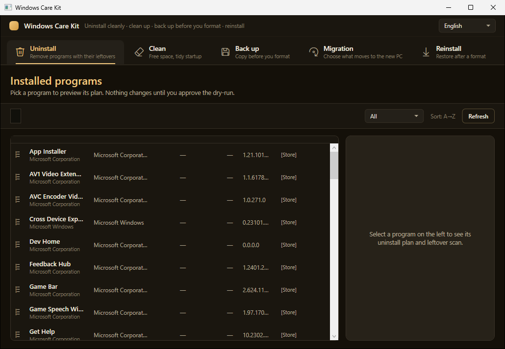
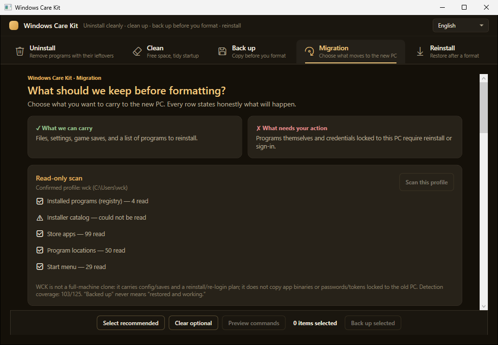
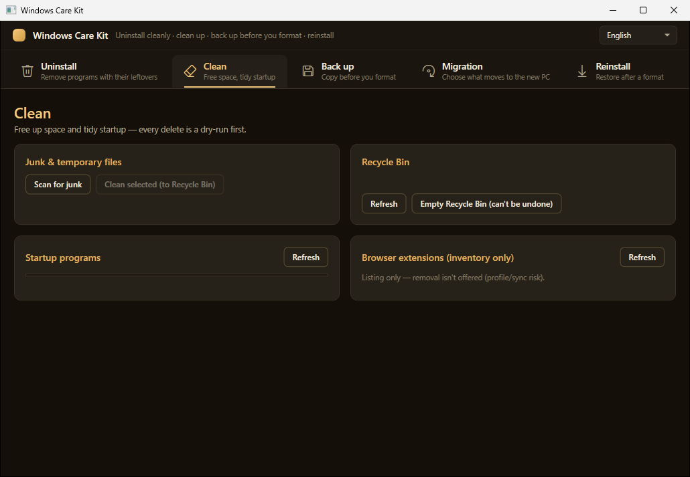
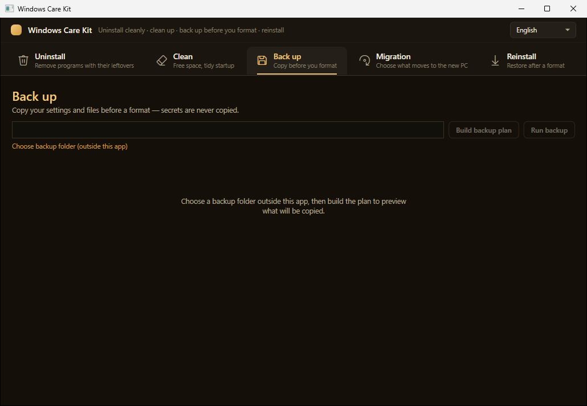
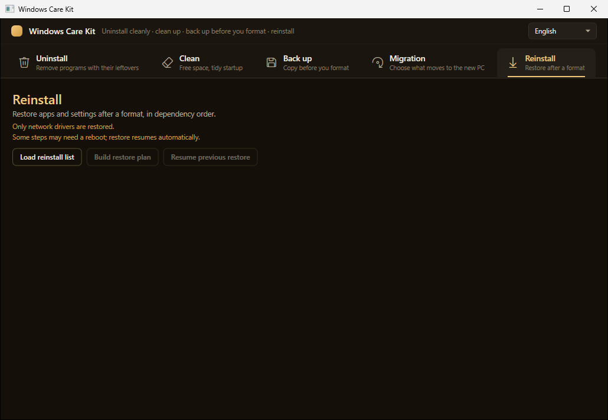

<div align="center">

[English README](README.md)

# 🛡️ Windows Care Kit

**Windows'u yeniden kurarken ayarlarınızı yanınızda taşıyın — ve onları doğru yere geri alın.**

*Açık kaynak, reklamsız, kökten dürüst: başarıyı taklit etmek yerine nelerin taşınamayacağını söyler. Tüm format yaşam döngüsünü kapsar: Kaldır · Temizle · Yedekle · Yeniden Kur.*

[](https://github.com/ydbilgin/windows-care-kit/actions/workflows/ci.yml)  [](LICENSE)  



</div>

---

## ⚠️ Durum — Beta, önce bunu okuyun

Dört modülün tamamı **uygulanmış** durumda, build **temiz (0 uyarı / 0 hata)** ve test paketi **1.080+ otomatik testten** geçiyor. Her yıkıcı işlem, tek bir güvenlik kapısı üzerinden **yalnızca dry-run önizleme + açık onayınızdan sonra** çalışır.

> **🚧 Gerçek dünyadaki yıkıcı işlemler hâlâ gözetimli testten geçiyor.** Bunu **beta** olarak değerlendirin: önemsediğiniz bir makinede silme, geri yükleme veya taşıma yaptırmadan önce her zaman ayrı bir yedeğiniz olsun. Nelerin tamamlandığını ve nelerin planlandığını görmek için [Yol Haritası](#-yol-haritası) bölümüne bakın.

---

## 🤔 Nedir?

Windows Care Kit, tüm **format / yeniden kurulum yaşam döngüsünü** kapsayan **tek bir yerel Windows uygulamasıdır** — normalde üç dört ayrı, çoğu reklamlı ve opak araçla yürütülen işleri bir araya getirir. **Açık kaynaklı, reklamsız, telemetrisiz ve denetlenebilir** bir araçtır; ayrıca **dürüsttür**: bir şey *güvenle* taşınamıyorsa (şifreli parola, yalnızca bulutta bulunan kayıt), uygulama başarı taklidi yapmak yerine bunu size söyler.

| Modül | TR | Ne yapar |
|---|---|---|
| 🗑️ **Uninstall** | **Sil** | Klasik + UWP uygulamaları kaldırır, artıkları tarayıp temizler, resmi kaldırıcıyı çalıştırır, kullanıcı bazlı AppX kaldırma yapar |
| 🧹 **Clean** | **Temizle** | Gereksiz/geçici dosya temizliği (Geri Dönüşüm Kutusu'na), başlangıç yöneticisi, tarayıcı eklentisi envanteri, Geri Dönüşüm Kutusu'nu boşaltma |
| 💾 **Backup** | **Yedekle** | Format öncesinde *yeniden indirilemeyen az sayıdaki önemli şeyi* manifest tabanlı olarak yedekler |
| 📦 **Install** | **Kur** | Format sonrasında uygulamaları winget/npm ile yeniden kurar, ayarları güvenli ve zaman damgalı `.bak` birleştirmesiyle geri yükler |

**Kimler için:** oyuncular, AI/geliştirici güç kullanıcıları ve Windows'u yeniden kurmak üzere olup önemli şeylerini kaybetmek istemeyen herkes.

---

## 📸 Ekran Görüntüleri

> Uygulama arayüzü varsayılan olarak İngilizce'dir (sağ üstten dil seçilebilir); ekran görüntüleri İngilizce arayüzü gösterir.

**💼 Taşıma (Migration) — dürüst kısım**



**🗑️ Sil (Uninstall)**


**🧹 Temizle (Clean)**



**💾 Yedekle (Backup)**



**📦 Kur (Reinstall)**



---

## ✨ Özellikler

### 🗑️ Sil — Uninstall
- Yüklü **klasik (Win32) ve UWP/Store** uygulamaların salt okunur envanteri.
- Uygulamanın **resmi kaldırıcısını** çalıştırır, ardından geride bıraktığı dosya/kayıt defteri anahtarları için **artık temizleme sihirbazı** sunar.
- Store uygulamaları için **kullanıcı bazlı AppX kaldırma**.
- Her kaldırma: **dry-run önizleme → siz onaylarsınız → işlem çalışır** (asla sessizce değil).

### 🧹 Temizle — Clean
- **Gereksiz / geçici dosya tarama ve temizleme** — kaldırılanlar kalıcı silinmez, **Geri Dönüşüm Kutusu'na** gider (geri alınabilir).
- **Başlangıç yöneticisi** — açılışta çalışan öğeleri görür ve devre dışı bırakırsınız.
- **Geri Dönüşüm Kutusu'nu boşaltma** — açık onayın arkasındadır ve günlüğe yazılır.
- **Tarayıcı eklentisi envanteri** — kurulu eklentileri listeler, klasörünü açar.

### 💾 Yedekle — Backup
- Format öncesinde vazgeçilmez şeyler için **manifest tabanlı plan**.
- **Araç / payload ayrımı:** yeniden indirilebilir uygulamalar **asla kopyalanmaz** — yalnızca bir *kurulum listesi* yazılır, böylece yedeğiniz küçük kalır.
- **Gizli veri deposu dışlama zorunludur:** tarayıcı çerezleri, kayıtlı parolalar, token depoları (`Login Data`, `Local State`, `key4.db`, …) yedeğe **kopyalanmaz**.
- İnsan tarafından okunabilir **`RAPOR.md`** (rapor) ve **`MANUAL_TODO.md`** (yalnızca *sizin* yapabileceğiniz işler — ör. bir yerde yeniden oturum açma) üretir.
- Kişisel yedek veriniz uygulamanın **dışında** yaşar, asla repoda durmaz.

### 📦 Kur — Install / Restore
- Mantıklı bir **geri yükleme sırası** ve **checkpoint/resume** ile **winget / npm yeniden kurulum planı**.
- **Kurulumdan sonra ayarları geri yükleme** — yapılandırma dosyaları uygulama mevcut olduktan **sonra** birleştirilir, körlemesine üzerine yazmamak için zaman damgalı **`.bak`** alınır.
- **Auth probe** — nerelerde yeniden oturum açmanız gerektiğini söyler.

### 💼 Format taşıma (Ayar Taşınabilirliği)

Migration ekranı, taşınabilir ayarları bulmak ve yeni bir Windows profiline nelerin taşınabileceğine
dair seçilebilir, dürüst bir önizleme sunmak için **40-app recipe-tabanlı tespit kataloğu** kullanır.

**Makineye kilitli ayarlar için dürüst erteleme:** recipe'ler, başka bir makinede güvenilir biçimde
yeniden bağlanamayan ayarları manuel veya ertelenmiş olarak sınıflandırır. Bunlar hiçbir zaman
başarılı bir otomatik geri yükleme gibi gösterilmez. Önizleme neyin tespit edildiğini, neyin uygun
olduğunu ve nelerin hâlâ manuel iş gerektirdiğini açıklar.

**Bugün mevcut:** WPF Migration ekranında recipe-tabanlı tespit, seçim ve **canlı yakalama (capture)** —
bir yedek klasörü seç, dry-run planı onayla, seçilen ayarlar aynı güvenlik-kapılı yedekleme motoruyla
oraya kopyalanır (makineye-kilitli öğeler dürüstçe gösterilir, asla sahte-başarı yok). **Yeni makinede
geri yükleme akışı (ayarları temiz kuruluma yerine yazma) sonraki slice'tır ve bu build'de henüz yok.**

---

## 🔒 Güvenlik modeli (pazarlık yok)

Çoğu "temizleyici" aracın yanlış yaptığı bölüm burasıdır. Burada çekirdek tasarım budur:

- **Tek kapı, istisna yok.** Her yıkıcı işlem tek bir **`SafetyGate`** içinden geçer (sistem klasörü korumaları, junction/symlink çözümleme, korumalı süreç/servis korumaları) ve yürütme zamanında **yeniden doğrulanır** (TOCTOU güvenli).
- **Önce dry-run, her zaman.** Siz yazılmış, risk sınıflandırılmış planı görüp **onaylamadan** hiçbir şey olmaz.
- **Dürüst arayüz.** Bir şey taşınamıyorsa (DPAPI ile şifrelenmiş parolalar, yalnızca bulut kayıtları), uygulama **bunu söyler** — başarı taklidi yapmaz.
- **Telemetri yok, analitik yok, phone-home yok.** Uygulama kendi kendine hiçbir sunucuya bağlanmaz. Tek ağ etkinliği, *siz* Install modülünü çalıştırdığınızda olur — uygulamalarınızı `winget`/`npm` ile yeniden kurar ve indirme başlamadan önce size tam, onaylanmış planı gösterir.
- **Araç/payload ayrımı + gizli veri dışlama** sayesinde yedek kimlik bilgilerinizi sızdırmaz.
- **Denetlenebilir:** tek bir onaylı yürütme katmanı, yıkıcı API'ler bunun dışında kullanılırsa **build'i bozan** bir analyzer ve redakte edilmiş **yürütme günlüğü**.

---

## ⬇️ İndir & çalıştır

1. En yeni **self-contained, single-file, portable ZIP** paketini [Releases](https://github.com/ydbilgin/windows-care-kit/releases) sayfasından indirin.
2. ZIP'in **SHA256** değerini release sayfasındaki değerle doğrulayın.
3. Açın ve çalıştırın — **installer yok**, sistem klasörlerine hiçbir şey yazılmaz.

> **Not:** build **imzasızdır** (bu ücretsiz, gelir üretmeyen bir proje olduğu için kod imzalama sertifikası yok). Windows **SmartScreen** ilk çalıştırmada uyarabilir — imzasız uygulamalar için bu beklenen bir durumdur; SHA256 kontrolü bütünlük garantinizdir. **Otomatik güncelleyici yoktur** — Releases sayfasını kontrol edin.

---

## 🛠️ Kaynaktan build

**.NET 10 SDK** gerekir.

```powershell
git clone https://github.com/ydbilgin/windows-care-kit.git
cd windows-care-kit
dotnet build WindowsCareKit.slnx -c Release
dotnet test  WindowsCareKit.slnx
```

Proje yerleşimi: `src/` (modüller + güvenlik çekirdeği + yürütme katmanı), `tests/` (otomatik testler), `docs/` (mimari ve güvenlik notları).

---

## 🤖 Geliştirme iş akışı — Codex ile geliştirildi

Windows Care Kit, birincil kodlama ajanı olarak **OpenAI Codex** ile geliştirilir ve sürdürülür.
Her değişiklik yazılı bir spekten başlar; **Codex implementasyonu ve otomatik testleri yazar**
(test paketi **1.080+ testten** oluşur, varsayılan olarak host-safe), ve her değişiklik maintainer
tarafından merge edilmeden önce bağımsız, çok geçişli bir incelemeden geçer. Codex ayrıca rutin
maintainer işlerini de yürütür — build/test doğrulaması, changelog ve doküman güncellemeleri,
recipe katalog hijyeni.

Bu, **yıkıcı, sistem seviyesinde işlemler** yapan bir araç için bilinçli bir tercihtir: uygulamanın
kullanıcılarına vaat ettiği aynı disiplin (spek → inceleme → asla başarı taklidi yapma) kendi
geliştirme sürecine de uygulanır. Ajanın çalışma kuralları [`AGENTS.md`](AGENTS.md) içinde yaşar;
scope belirleme, son inceleme ve her merge kararı insan maintainer'a aittir.

---

## 🗺️ Yol Haritası

**Bugün mevcut (beta):** yukarıdaki dört modül, güvenlik kapısı + gated executor, EN/TR UI, otomatik test paketi.

**Tasarlanmış & planlanmış (bu build'de henüz yok):** daha zengin bir Backup/Restore motoru —
- 🔎 Yerel uygulama ayarları ve geliştirici/AI-CLI yapılandırmaları (Codex/Discord/VS Code…) için **auto-discovery katalog**, checkbox seçim ekranı + manuel yol ekleme.
- 🖥️ **Makine farkındalıklı restore** — kaynak/hedef makineyi (kullanıcı profili, sürücü harfleri, bilinen klasörler) soyutlayarak yedeğin *farklı* bir PC'de gerçekten çalışmasını sağlar.
- 💽 **Çoklu sürücü taraması** (yalnızca C: değil), bulut yedekliliği tespitiyle (Steam Cloud / OneDrive zaten tutuyorsa atla).
- 📋 **Paket envanteri** — pip/npm/winget içinde *nelerin kurulu olduğunu* yakala (dosyaları değil, listeyi) ve yeniden kur.
- 📥 **Import / "recovery profile"** — taşınabilir seçim profili + eksik uygulamaların isteğe bağlı otomatik kurulumu.
- 🎮 **İsteğe bağlı oyun dosyası yedeği** (Steam/Epic), platform sınırlarını dürüstçe belirterek (Xbox/Game Pass = yalnızca yeniden kurulum).

Tam tasarım kararları için `docs/` klasörüne bakın.

---

## 🤝 Katkıda bulunma

Issue ve PR'lar memnuniyetle karşılanır. Bu uygulama **yıkıcı, sistem seviyesinde işlemler** yaptığı için katkılar bu bakışla incelenir:
- Yıkıcı kod **yalnızca** onaylı yürütme katmanında yaşar; analyzer bunu zorlar.
- Yeni davranış test ister; testler **fake/sentetik veri** kullanır, asla gerçek kişisel veri kullanmaz.
- Geliştirme ve bildirim süreci için [`CONTRIBUTING.md`](CONTRIBUTING.md) ve [`SECURITY.md`](SECURITY.md) dosyalarına bakın.

## 🔐 Güvenlik

Bir güvenlik sorunu mu buldunuz? Lütfen public issue açmak yerine özel olarak bildirin (bkz. [`SECURITY.md`](SECURITY.md)). Bu proje kullanıcı verisi güvenliğini temel vaadi olarak görür.

## 🕵️ Gizlilik

Telemetri yok, analitik yok, phone-home yok — uygulama kendi kendine hiçbir sunucuya bağlanmaz. Tek ağ etkinliği, *siz* Install modülünü çalıştırdığınızda olur; uygulamalarınızı `winget`/`npm` ile yeniden kurar ve indirme başlamadan önce size tam, onaylanmış planı gösterir. Yedek veriniz (`payload/`) asla repoya girmez ve *siz* taşımadıkça makinenizden ayrılmaz.

## 🌍 Dil

UI **İngilizce ve Türkçe (EN/TR)** olarak gelir. İngilizce için [English README](README.md) dosyasına bakın.

## 📄 Lisans

[MIT](LICENSE).

---

<div align="center">
<sub>Açıkta geliştirildi. Reklam yok, takip yok, karanlık desen yok — yalnızca sisteminize dokunmadan önce gerçeği söyleyen bir araç.</sub>
</div>
